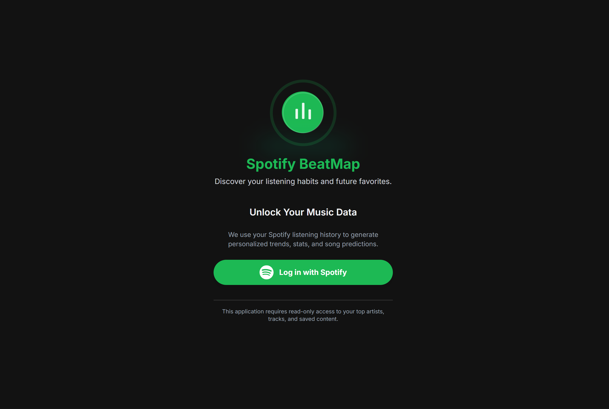

# BeatMap — Spotify listening analytics (Next.js)

Your dark‑glass Spotify playground to explore top tracks & artists, cruise playlists, and relive recent jams ~ and (soon) get smart predictions for what you'll love next ( ◡̀_◡́)ᕤ.

> **Status:** active WIP. First milestone focuses on **fetching all user data** and rendering a clean, responsive UI. Milestone 2 (next): **taste‑based predictions & recommendation endpoints**.

---

## ✨ Features

* **Login with Spotify (PKCE)** and persistent session
* **Profile** (avatar, display name, followers)
* **Top Tracks** (responsive grid tiles)
* Dark, glass‑morphism theme (`glass-card`, `spotify-button`, `white-glow`) matching Spotify’s aesthetic
* Accessible motion (respects `prefers-reduced-motion`), keyboard‑friendly focus states

---

## 🧰 Tech Stack

* **Next.js (App Router)** + **TypeScript**
* **React**
* **Tailwind CSS** (custom classes + utilities)
* **Framer Motion** (subtle logo/element animations)
* **Spotify Web API** (OAuth 2.0 + PKCE)

---

## 📷 Screenshots (placeholders)

* `docs/screenshot-login.png` — login screen




---

## 🚀 Quick Start

### 1) Create a Spotify Developer App

1. Go to the Spotify Developer Dashboard and create an app.
2. Add a Redirect URI (for local dev):

   * `http://127.20.10.3:5000/api/spotify/callback`
3. Note your **Client ID** (and **Client Secret** if you’re using a confidential flow). This project supports **PKCE**.

### 2) Configure environment

Create `.env.local` in the project root:

```bash
# App
BASE_URL=http://127.20.10.3:5000

# OAuth
SPOTIFY_CLIENT_ID=YOUR_CLIENT_ID
SPOTIFY_REDIRECT_URI=http://127.20.10.3:5000/api/spotify/callback
SPOTIFY_SCOPES=user-read-email user-top-read user-read-recently-played user-read-playback-position user-read-playback-state user-read-currently-playing 
```

> If you run dev on another host/port, keep `SPOTIFY_REDIRECT_URI` in sync with your Spotify app settings.

### 3) Install & run (Yarn)

```bash
yarn install

# dev
yarn dev -p 5000

# production
yarn build
yarn start -p 5000
```

Open **[http://127.20.10.3:5000](http://127.20.10.3:5000)**.

---

## 🔌 API Routes (shape & expectations)

All endpoints return either `[{...}]` or `{ items: [...] }`. The client normalizes both.

* `GET /api/spotify/me` → Spotify user profile
* `GET /api/spotify/top-tracks` → `{ items: Track[] }`

For 401 responses, routes should return `{ error: "Unauthorized" }` with status **401**.

---

## 🧪 Data Service (client-side)

`lib/spotifyClient.ts` centralizes fetch logic and response normalization.

```ts
export class SpotifyService {
  static async getUser() { /* /api/spotify/me */ }
  static async getTopTracks() { /* /api/spotify/top-tracks */ }
}
```

---

## 🔐 Auth Notes

* Uses **Authorization Code with PKCE**.
* Store tokens in **HTTP‑only cookies** on the server (avoid `localStorage`).
* On failures during callback, redirect to `/?error=login_failed`. The login page displays a **persistent** error banner until success.

---

## ♿ Accessibility

* Respects `prefers-reduced-motion` (disables non-essential animations)
* Alt text on all images
* Contrast‑friendly palette
* Keyboard‑focusable buttons/links

---

## 📜 License & Disclaimer

* License: **MIT** (see `LICENSE`)
* Not affiliated with **Spotify AB**. All trademarks, logos, and brand names are the property of their respective owners.
* This app is for **personal, non‑commercial** use.
